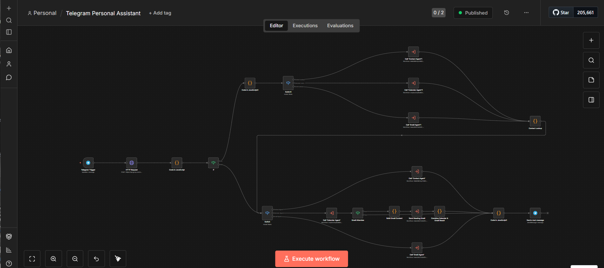
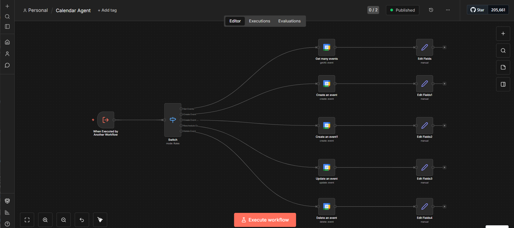
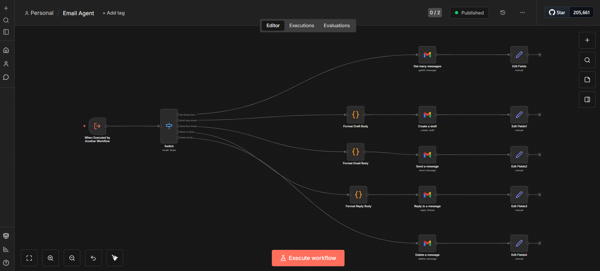
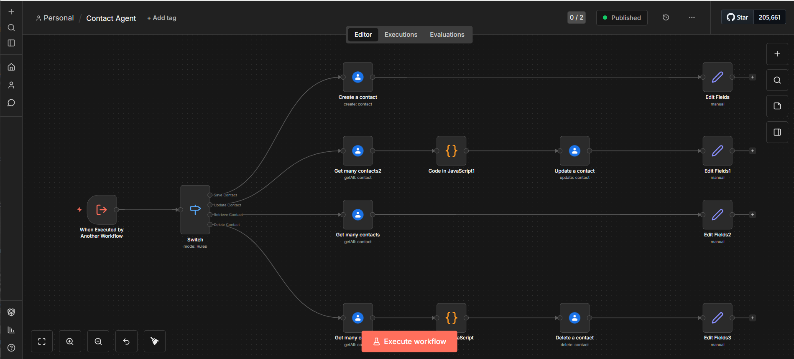
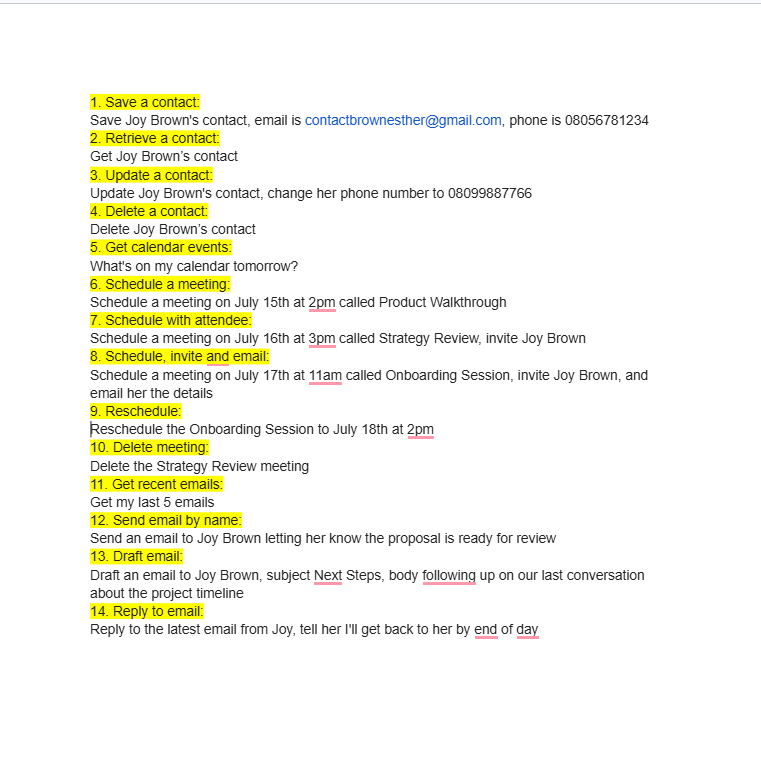

# n8n Telegram Personal Assistant

A self-hosted, multi-agent personal assistant built entirely in n8n, 
running on Telegram as the interface.

## What it does
Lets a user manage their calendar, email, and contacts through a single 
Telegram chat — no switching between apps. Send a message like "schedule 
a call with Ibiye tomorrow at 3pm" and the assistant routes it to the 
right agent, resolves the contact, books the event, and confirms back 
in Telegram.

## Stack
- n8n (workflow orchestration, self-hosted via Docker)
- Groq / Llama 3.3-70b (intent parsing and routing)
- Google Calendar, Gmail, Google Contacts (integrations)
- Telegram Bot API (interface)
- Migrated from Windows to Mac via Docker

## How it works
An incoming Telegram message is sent to an LLM (Groq/Llama 3.3) that 
classifies the intent — contact, calendar, or email — and extracts the 
relevant fields into structured JSON. A router (Switch node) then calls 
the matching sub-agent workflow. If a message references a person by 
name instead of an email, a contact lookup runs first to resolve it 
before the action executes. The result is summarized back into plain 
language and sent to the user via Telegram.

14 features total across the three agents.

## Demo https://www.loom.com/share/b583d388b9184386928fd99c51b1bb54
## Files
- `Telegram Personal Assistant (2).json` — main router: receives the message, 
  parses intent, routes to the correct agent
- `Calendar Agent (2).json` — handles get/create/reschedule/delete for events
- `Email Agent (2).json` — handles get/draft/send/reply/delete for Gmail
- `Contact Agent (2).json` — handles save/update/retrieve/delete for contacts

## Screenshots

## Note
API keys and credentials have been removed from these exports. To run 
this yourself, you'll need your own Groq API key and Google OAuth 
credentials set up in n8n.
